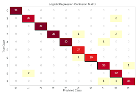

# alpaco0304

## 프로젝트 수행
1. 수행 기관: 알파코 딥러닝 부트캠프
2. 수행 날짜: 2024.2.1 ~ 2024.3.4
3. 수행 스택: 웹(플라스크)과 딥러닝(CNN) 사용
4. 데이터: 0~9의 숫자 이미지로 이루어진 MNIST train 6만장 test 3만장으로 사용

## 수행 결과
1. 결과 이미지

2. 전체 설계도 이미지

참고: Krizhevsky, Alex, Ilya Sutskever, and Geoffrey E. Hinton. "Imagenet classification with deep convolutional neural networks." Advances in neural information processing systems 25 (2012).

## 느낀점
CNN으로는 0~9 이미지의 학습 성능이 잘 나왔지만 transform을 어떻게 주냐에 따라서 성능을 감소시키는 기법들이 뭐인지 리포트하고 싶었다.
